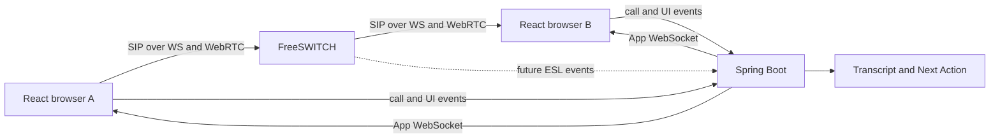

# Ecallipse

Ecallipse은 사용자가 직접 통화하면서 필요한 AI 보조 기능을 조합하는 call workspace POC다. 통화 자체를 별도 업무로 끝내지 않고 transcript, next action, checklist, notes를 이후 행동으로 이어 가는 방식을 검증한다.

현재는 내부 사용자 간 1:1 통화의 가장 작은 흐름을 만든 상태다. 브라우저에서 연락처를 선택하고, incoming call을 수락한 뒤, 통화 화면에서 Widget을 자유롭게 구성할 수 있다.

## 현재 POC 범위

- Landing, 더미 로그인과 회원가입 화면
- Alice/Bob 더미 계정 기반 연락처와 1:1 logical call lifecycle
- Application WebSocket 기반 incoming call modal과 realtime transcript/Next Action UI
- 이동, 리사이즈, 추가, 제거, 별도 창 분리가 가능한 call Widget workspace
- SIP.js와 FreeSWITCH를 이용한 browser SIP registration, call, answer, hangup 경로
- FreeSWITCH local image, OPUS, WebSocket signaling, 좁은 RTP port range

실제 WebRTC 양방향 audio는 아직 완료로 검증하지 않았다. STT는 `/api/poc/**`의 수동 입력이고 Next Action은 deterministic fake다. 실제 STT/LLM, ESL backend 연동, persistence, production auth, PSTN, recovery, billing은 현재 범위 밖이다.

## Structure

```text
ecallipse/
├─ backend/              Spring Boot and Gradle build
├─ frontend/             React, TypeScript and Vite build
├─ infra/freeswitch/     Local FreeSWITCH image and configuration patch
├─ docs/                 Requirements
├─ compose.yaml          Local Postgres and FreeSWITCH services
└─ AGENTS.md             Project working guidelines
```

Repository는 하나지만 frontend와 backend는 독립적으로 빌드한다. Root에는 전체 개발 환경만 실행하는 Compose 설정을 둔다.

## Prerequisites

- Java 25 toolchain
- Node.js and npm
- Docker Desktop with Docker Compose
- Chrome 또는 Edge 같은 WebRTC 지원 브라우저와 마이크 권한

PowerShell 실행 정책 때문에 npm 대신 `npm.cmd`가 필요할 수 있다.

## Run locally

먼저 root에서 local infrastructure를 실행한다. `.env.example`을 `.env`로 복사하고 `POSTGRES_PASSWORD`를 원하는 값으로 바꾼다.

```powershell
Copy-Item .env.example .env
docker compose up --build -d
.\infra\freeswitch\scripts\check-status.ps1
```

Backend를 별도 terminal에서 root에서 실행한다.

```powershell
.\gradlew.bat :backend:bootRun
```

Frontend를 또 다른 terminal에서 실행한다.

```powershell
Set-Location frontend
npm.cmd ci
npm.cmd run dev
```

`http://127.0.0.1:5173`을 두 browser window 또는 profile로 연다. 한 창에서 Alice, 다른 창에서 Bob으로 로그인한다. Alice가 Contacts에서 Bob에게 전화를 걸고 Bob이 incoming modal에서 수락한다.

SIP 기본 설정은 `ws://127.0.0.1:5066`, `localhost`, password `ecallipse`이다. 다른 local SIP endpoint를 쓸 때만 `frontend/.env.example`을 `.env`로 복사해 값을 바꾼다.

## Verify

```powershell
.\gradlew.bat :backend:test
.\gradlew.bat :backend:build
```

```powershell
Set-Location frontend
npm.cmd run lint
npm.cmd test
npm.cmd run build
```

FreeSWITCH healthcheck는 server process, Sofia, OPUS, internal profile을 확인한다. 이는 browser-to-browser media 검증은 아니다.

## Call flow



FreeSWITCH는 telephony와 media를 담당한다. Spring Boot는 logical call, transcript, AI assistance 같은 product state를 담당한다. 두 lifecycle을 같은 것으로 취급하지 않는다.

## Documentation

- [Requirements](docs/requirements.md)
